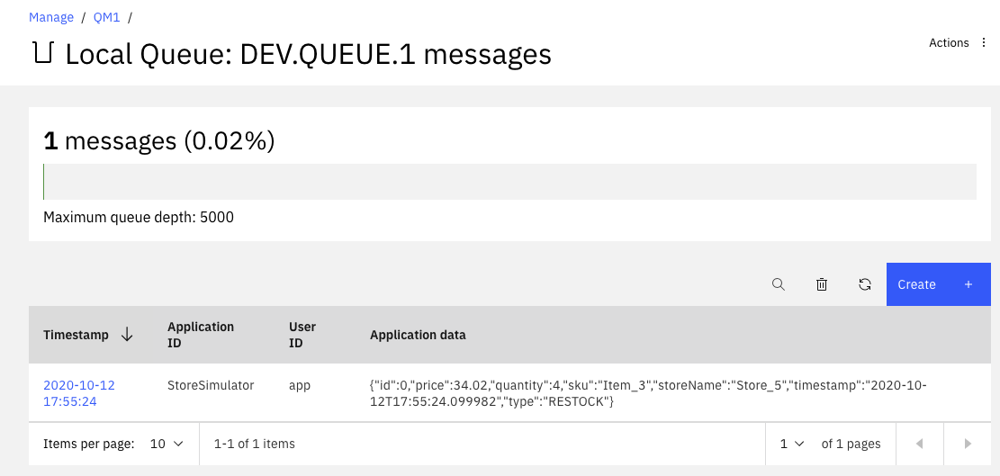
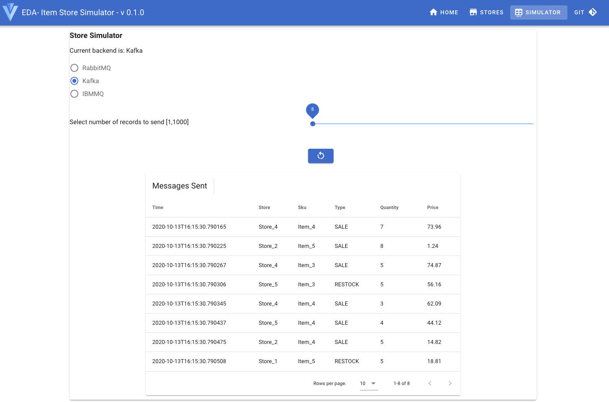

# Store sale event producer simulator

The store sales simulator application aims to demonstrate an end-to-end new real-time inventory solution based on event-driven architecture
and data streaming capabilities. It supports the following features:

* Expose a simple user interface to simulate store selling items which are sent to Queue or Topic. 
* Randomly create item sale events ( includes restocks) and send them to Kafka or RabbitMQ or IBM MQ depending of the application configuration.
* Integrate with external services to query the item inventory and store inventory interactive queries supported by Kafka Streams. 
(See projects: [refarch-eda-item-inventory](https://github.com/ibm-cloud-architecture/refarch-eda-item-inventory) and [refarch-eda-store-inventory](https://github.com/ibm-cloud-architecture/refarch-eda-store-inventory))

This implementation is done with Java 11 and [Quarkus](https://quarkus.io) 2.2.x with the AMQP reactive messaging extension to send messages to RabbitMQ, 
or with the Kafka producer API to send message directly to Kafka, or using JMS to send to IBM MQ. 

The end-to-end solution demonstration is documented in a separate deep dive lab in [this article](https://ibm-cloud-architecture.github.io/refarch-eda/scenarios/realtime-inventory/).

With this repository, you can validate sending message to the different back-ends using a single User Interface. All the images are in `quay.io` registry, but
for development purpose we recommend to clone this repository. 

```shell
git clone https://github.com/ibm-cloud-architecture/refarch-eda-store-simulator
```

Updates:

* 01/06/2021: Quarkus 1.10.5- Rabbit MQ 3.8 on local docker deployment, and Kafka 2.6. IBM MQ 9.2.
* 04/01/2021: Quarkus 1.13, Add Kustomize for gitops deployment
* 05/04/2021: Quarkus 1.13.2, Simplify environment folder, add codeql-analysis git workflow.
* 09/30/2021: Quarkus 2.2.3: add view of existing inventory

## Build the application locally

The docker image for this application is already available on [quay.io registry](https://quay.io/ibmcase/eda-store-simulator).

The `buildAll.sh` scripts runs Maven packaging and docker build and push the image to `quay.io`. So you need to change this script to push to your own registry.

```shell
docker login quay.io -u ...
./scripts/buildAll.sh 
```

To only build the jar file do:

```sh
./mvnw clean package -Dui.deps -Dui.dev -DskipTests
# Without UI
./mvnw clean package -DskipTests
```

## Run the application locally

To run this application locally and assess all the different integration middleware (Kafka, RabbitMQ or MQ) first start all the components:

```shell
cd environment/all
docker-compose up -d 
```

### For Rabbit MQ

Normally the queue is created automatically when running the app, but if you want to create it upfront, the following steps can be done:

* Download `rabbitmqadmin` client from http://localhost:15672/cli/rabbitmqadmin. One version of this script is available in the `environment` folder.

* Declare the queue:

```shell
# under environment folder
./rabbitmqadmin declare queue name=items durable=true -u rabbit-user -p rabbit-pass
```

* List the available queues:

```shell
# under environment folder
./rabbitmqadmin list declara queue name=items durable=false -u rabbit-user -p rabbit-pass
```

See more rabbitmqadmin CLI options [in https://www.rabbitmq.com/management-cli.html](https://www.rabbitmq.com/management-cli.html).

To validate sending message to RabbitMQ do the following steps:

* Go to the App console - simulator tab [http://localhost:8080/#/simulator](http://localhost:8080/#/simulator)
* Select RabbitMQ toggle and then the number of message to send.


* Access Rabbit MQ Console: [http://localhost:15672/#/](http://localhost:15672/#/) user RabbitMQ, to verify messages are in the queue,


### For IBM MQ

Using the same approach as above, we can select to send to IBM MQ: use the IBM MQ toggle and send some messages: 


The simulator trace should display similar messages:

```trace
sent to MQ:{"id":0,"price":25.15,"quantity":4,"sku":"Item_2","storeName":"Store_2","timestamp":"2020-10-13T16:48:35.455027","type":"RESTOCK"}

sent to MQ:{"id":1,"price":73.09,"quantity":3,"sku":"Item_1","storeName":"Store_1","timestamp":"2020-10-13T16:48:35.455082","type":"RESTOCK"}

sent to MQ:{"id":2,"price":68.85,"quantity":2,"sku":"Item_4","storeName":"Store_4","timestamp":"2020-10-13T16:48:35.455123","type":"RESTOCK"}

sent to MQ:{"id":3,"price":60.31,"quantity":9,"sku":"Item_2","storeName":"Store_5","timestamp":"2020-10-13T16:48:35.455168","type":"RESTOCK"}
```

And connecting to IBM MQ console [https://localhost:9443](https://localhost:9443/ibmmq/console/#/qmgr/QM1/queue/local/DEV.QUEUE.1/view), using admin/passw0rd credential:



Verify messages are sent.

### For Kafka

First be sure the `items` topic is created, if not, run the following command:

```shell
./scripts/createTopics.sh
```

Finally same process applies for Kafka, from the simulator:



Looking at the Simulator trace, you can see the record offset for the message sent.

```trace
sending to items item {"id":5,"price":44.12,"quantity":4,"sku":"Item_4","storeName":"Store_5","timestamp":"2020-10-13T16:15:30.790437","type":"SALE"}

(kafka-producer-network-thread | StoreProducer-1) The offset of the record just sent is: 6
```

Or using the following command to consumer all the messages from the `items` topic:

```shell
docker run -ti strimzi/kafka:latest-kafka-2.8.0 bash -c "/opt/kafka/bin/kafka-console-consumer.sh --bootstrap-server kafka:29092 --topic items --from-beginning"
```

## Development mode - run locally

When developing the application, you may want to test against only one backend. 
As the simulator can use three potential environments: kafka with local strimzi, Rabbitmq and IBM MQ, we have setup different docker compose configuration to run those middleware separately.

### RabbitMQ running the application in dev mode

Go under the `environments/rabbitmq` folder and start the two docker containers:

```shell
# under environments/rabbitmq folder
docker-compose docker-compose up
# Start quarkus
./mvnw quarkus:dev
```

Access the API via: [http://localhost:8080/swagger-ui/#/](http://localhost:8080/swagger-ui/#/)

In the Queues page, see the content of the `items` queue, and use the 'get messages' to see the queue content.

### User Interface development

The user interface is done in Vue.js under the webapp folder, so it is possible via proxy configuration see ([vue.config.js file](https://github.com/ibm-cloud-architecture/refarch-eda-store-simulator/blob/master/webapp/vue.config.js)) to start `yarn serve` and access the UI connected to the simulator backend.

We recommend use docker to run nodejs to avoid potential conflicts with your local deployment. So the first time you start the node container do the following:

The following was lastly tested on 9/30/2021 so migrating to vue 5.0.0 and nodejs v16.10.0

```sh
# Under webapp folder
docker run -v $(pwd):/home -ti node bash
# In the bash shell
yarn global add @vue/cli
# May be needed to updated the vue app with
vue upgrade --next
# in another terminal
# get the container id
docker ps
# commit the new image. Change ibmcase to your own docker or quay.io name
docker commit <container_id> quay.io/ibmcase/vue_node
# Verify
docker images
```

From the image created above, or reusing our image (quay.io/ibmcase/vue_node) starts the image by exposing the port 4545

```shell
# under webapp folder
docker run -v $(pwd):/home -ti -p 4545:4545 quay.io/ibmcase/vue_node bash
# Under /home 
# Compiles and hot-reloads for development
yarn serve
```

Go the [http://localhost:4545/#/](http://localhost:4545/#/) to see the UI. 

Any development under the webapp will be automatically visible in the browser and any change to the Quarkus app are also reflected to make the end to end development very efficient.

### Kafka only (for development)

The compose file is under `environment/kafka` folder.

```shell
# under environments/kafka folder
docker-compose up -d

# Under webapp folder
# Compiles and hot-reloads for development
yarn serve

# under the root folder:
/mvnw quarkus:dev
```

To work on the UI development and test go the [http://localhost:4545/#/](http://localhost:4545/#/) to see the UI. 

To work on the backend API test using swagger UI: []()

### IBM MQ only for development

```shell
# under environments/mq folder
docker-compose  up -d
```

Then same commands as above.

### Packaging the UI and Quarkus app

```shell
# under webapp
yarn build
# under root folder
mvn package
docker build -f src/main/docker/Dockerfile.jvm -t ibmcase/eda-store-simulator .
```

## Implementation approach

The application is using one REST resource for defining the needed APIs: 


The messages sent are defined in the [domain/Item.java](https://github.com/ibm-cloud-architecture/refarch-eda-store-simulator/blob/master/src/main/java/ibm/gse/eda/stores/domain/Item.java) class.

The items sold are part of a simple predefined list of item with SKU defined as

```java
 static transient String[] skus = { "Item_1", "Item_2", "Item_3", "Item_4", "Item_5" };
 
```

The following extensions were added to add metrics, health end points, and OpenShift deployment manifests creation:

```shell
./mvnw quarkus:add-extension -Dextensions="quarkus-smallrye-openapi"
./mvnw quarkus:add-extension -Dextensions="smallrye-health"
./mvnw quarkus:add-extension -Dextensions="smallrye-metrics"
./mvnw quarkus:add-extension -Dextensions="openshift"
```

See the [pom.xml](https://github.com/ibm-cloud-architecture/refarch-eda-store-simulator/blob/master/pom.xml) file detail.

Each integration is done in a separate class under the infrastructure package:

* [Kafka producer with basic API](https://github.com/ibm-cloud-architecture/refarch-eda-store-simulator/blob/master/src/main/java/ibm/gse/eda/stores/infrastructure/kafka/KafkaItemGenerator.java)
* [Rabbit MQ with reactive messaging and AMQP](https://github.com/ibm-cloud-architecture/refarch-eda-store-simulator/blob/master/src/main/java/ibm/gse/eda/stores/infrastructure/rabbitmq/RabbitMQItemGenerator.java)
* [IBM MQ with JMS producer](https://github.com/ibm-cloud-architecture/refarch-eda-store-simulator/blob/master/src/main/java/ibm/gse/eda/stores/infrastructure/mq/MQItemGenerator.java)

## Deploy and run on OpenShift

To package the app as docker images with a build performed within the OpenShift cluster, 
we can use the source to image approach, by running the following command:

```shell
./mvnw clean package -Dui.deps -Dui.dev -Dquarkus.container-image.build=true -Dquarkus.container-image.group=ibmcase -Dquarkus.container-image.tag=1.0.0 -Dquarkus.kubernetes.deploy=true -DskipTests
```

As an alternate to deploy this application, we can use our Kustomize declarations from the `src/main/kubernetes` folder.

The configmap 

```sh
# log to OpenShift
oc login ....
# Create a new project
oc new-project test-store-simul
# deploy
oc apply -k src/main/kubernetes/store-simulator
```
